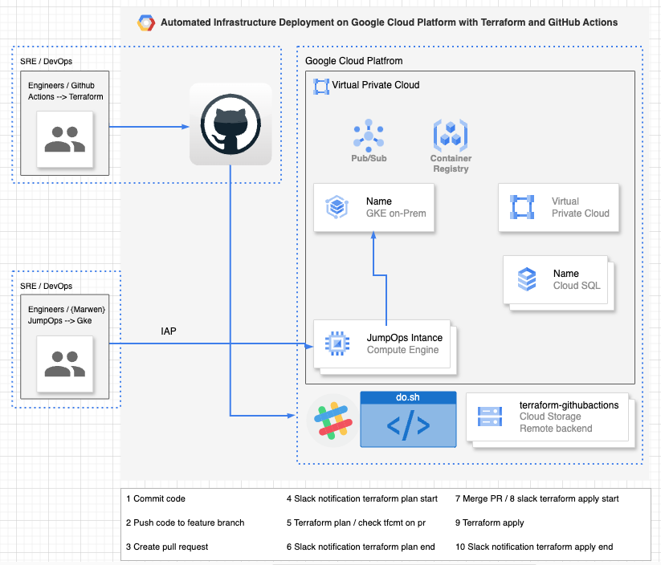
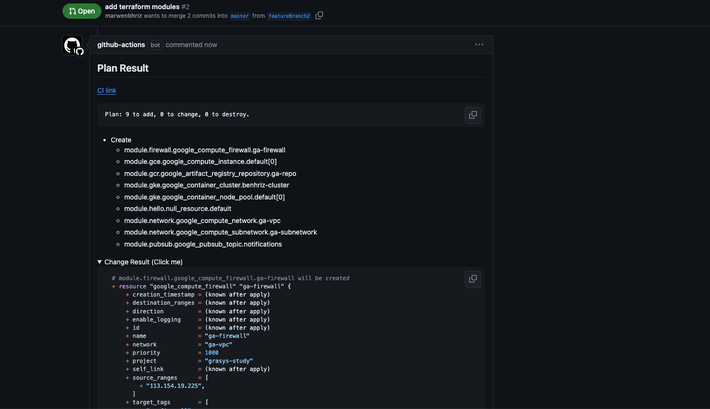
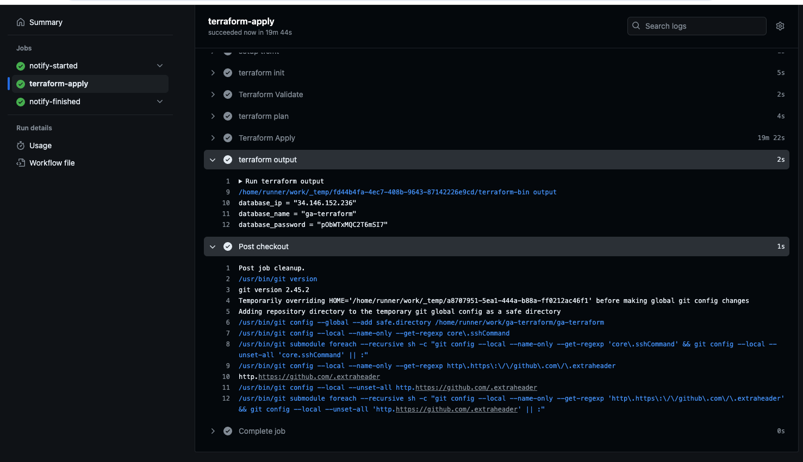
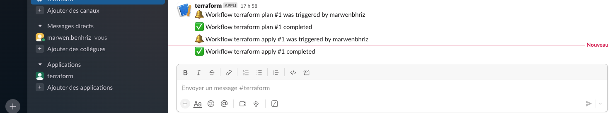

# Automated Infrastructure Deployment on Google Cloud Platform with Terraform and GitHub Actions

> Note: This setup combines the infrastructure-as-code approach of Terraform with the automation capabilities of GitHub Actions, streamlining the process of managing and deploying infrastructure on GCP.

> Note. There is an commented modules, not used due changed to another db, but still working{cloudsql/spanner} due cost, if remove the comment and make a pr will plan/apply this modules

## Objective

Building infrastructure on Google Cloud Platform (GCP) using Terraform and GitHub Actions enables automated provisioning and management of cloud resources. Terraform defines infrastructure as code, specifying GCP resources like VMs, databases, and networking. GitHub Actions automates Terraform workflows, ensuring consistent deployments, version control integration, and collaborative development practices.

## Prerequisites

List the prerequisites for running the project, such as:

Google Cloud Platform Account: You need a GCP account with appropriate permissions to create and manage resources.
Terraform: Install Terraform on your local machine or CI/CD environment. Refer to Terraform Installation Guide for instructions.
GitHub Actions: Familiarity with setting up GitHub Actions workflows. Refer to GitHub Actions Documentation for more details.

## Workflow



### Terraform Plan



### Terraform Apply



### Slack notification



### Tools
we estimate the cost of infra we are working to setup, by running this command.

```sh
./do.sh generate_cost_report JPY|USD
```

and also we scan and genrate a security check.

```sh
./do.sh audit_infra JSON|XML
```

and genrate a diagram of infra from tfsatat

```sh
./do.sh generate_diagram TFSTATE
```
generate_diagram

and important point due security issue we need to prevent access for jump ops from public so we need to fix iap for our ip and username for we can access to jump ops and then gke cluster.

```sh
./do.sh ssh_iap
```

### Need work
> Note. due i dont have a domain name, its perfect to have gke ingress to use our product, instead i used a LB ip, but recomanded to use gke ingress and genrate certificate for that.

> Note. There is a limitation in whole project due cost and permissions, but i try in this demo in show how my idea about setup infra and building cicd with the existent stack.
